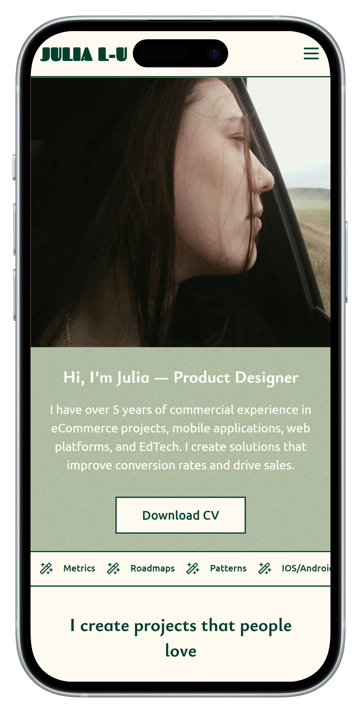
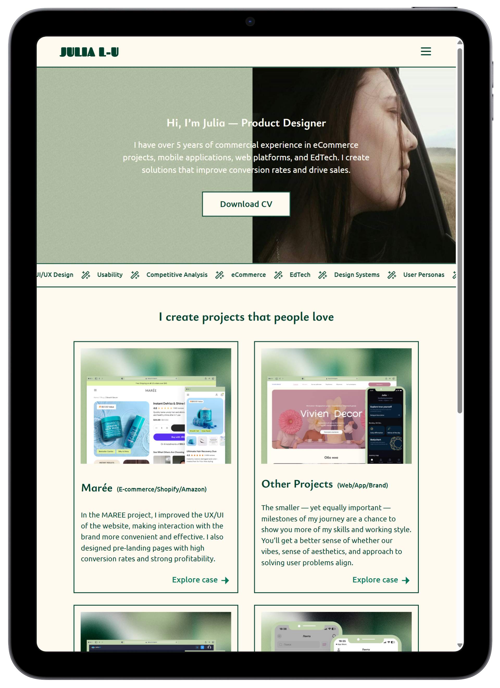

# 🎨 Julia Portfolio – React

A personal portfolio website for a UX/UI Designer – built with React.

---

## 🔗 Live Demo  
🌐 [Visit Site (GitHub Pages)](https://sercanisuzun.github.io/julia-portfolio-react/)  
> ⚠️ Domain and hosting setup is in progress. A custom domain will be connected later.

---

## 📱 Features  
- ✅ **Responsive** design for 4 screen sizes (mobile-first):  
  Mobile • Tablet • Desktop • Large Desktop  
- ⚛️ Built with **React**  
- 🌐 Routing handled by **React Router DOM**  
- 🌍 Multilingual: **English & Russian** via `i18next`  
- 🎨 Styled with **SASS**  
- 🔎 Basic **SEO** and **semantic HTML** used  
- 🧑‍🎨 Design provided by the client (UX/UI Designer)

---

## 🛠️ Tech Stack  
- React  
- React Router DOM  
- SASS (SCSS)  
- i18next  
- GitHub Pages (for deployment)

---

## 📸 Preview  

| Mobile | Tablet | Desktop |
|--------|--------|---------|
|  |  |  |

> Screenshots captured from real responsive layout

---

## 🚀 Getting Started (Local Setup)  
To run the project locally:

```bash
git clone https://github.com/SercaNisUzun/julia-portfolio-react.git
cd julia-portfolio-react
npm install
npm start
